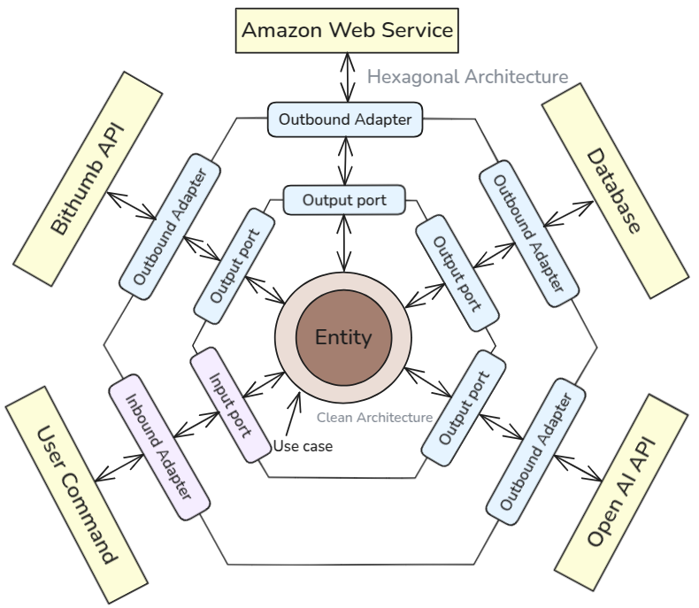

# Project Manager

1 person

# Project Duration

2025.06.06 ~

# Project GitHub Repository

[GitHub - ziogenorwekh/cryptocurrency-project](https://github.com/ziogenorwekh/cryptocurrency-project/tree/dev)

## 🎯 Project Goal

<aside>
 A cryptocurrency exchange web page clone project utilizing the API of a company providing cryptocurrency trading, including cryptocurrency trading and AI analysis.

</aside>

---

## 🏁 Project Outcomes

### 📎 Technical Stack

### 📌 Backend Technical Stack

- **Framework**: Spring Framework
- **Language**: Java
- **Build Tool**: Gradle
- **Databases**: MySQL (for testing and deployment), H2Database (for testing)
- **Architecture**: MSA (Microservices Architecture)
- **ORM (Object-Relational Mapping)**: JPA
- **Inter-service Communication**: Apache Kafka (asynchronous messaging broker)
- **Real-time Communication**: WebSocket
- **Caching**: Redis

### 📌 Infrastructure & Deployment

- **Containerization**: Docker
- **Container Orchestration**: Kubernetes
- **Configuration Management & Automation**: Jenkins (local execution) / Ansible (remote execution)
- **Cloud Services (AWS)**: EC2 (Compute), Route 53 (DNS Management), RDS (Database Management)
- **Monitoring & Visualization**:
    - **Prometheus**: Application and system metrics collection
    - **Grafana**: Prometheus data visualization dashboards

### 📌 Frontend Technical Stack

- **Framework/Library**: React
- **Styling**: Bootstrap
- **HTTP Client**: Axios
- **Authentication**: Google Login, Naver Login
- **Web Server/Reverse Proxy**: Nginx
- **Real-time Communication**: WebSocket API or library

### 📌 Development Methodology

- Agile Methodology
- Test-Driven Development (TDD), Domain-Driven Design (DDD)
- Hexagonal Architecture (Ports & Adapters), Use Case Driven Design
- **Unit Testing**: JUnit, Mockito
- **Integration Testing**: Spring Test
- **Performance/Load Testing**: Apache JMeter (for K8s environment load testing and monitoring integration)

---

## 🧍 Requirements

### Feature Specification

<aside>
 [1] User Access and Login**
└─> Frontend requests authentication via Google OAuth, etc.
└─> User Service handles authentication and issues JWT.

**[2] Market Data Inquiry**
└─> Frontend requests market price/order book/trade data.
└─> Trading Service -> Integrates with external exchange API or fetches from cache/DB.
└─> Returns the latest market price information to the frontend.

**[3] AI-Based Market Analysis Result Provision**
└─> When a user accesses the trading page, AI analysis results are displayed, updated every 6 hours.
└─> Market Data Collection & Analysis Service:
* Collects external market prices.
* Calls OpenAI.
* Caches and provides analysis results.

**[4] Asset Status and Transaction History Check**
└─> Frontend requests portfolio inquiry.
└─> Portfolio Service calculates user balance and unrealized/realized profit/loss.
└─> User Service combines transaction history for a comprehensive response.

**[5] Order Function (Buy/Sell/Reserved Orders)**
└─> Frontend requests trade (place/cancel order, etc.).
└─> Trading Service validates and processes orders.
└─> Integrates with exchange API or simulation engine.
└─> Records results and reflects them in User/Portfolio Service.

</aside>
### API Specification

### 1. User Service API

| Function | HTTP Method | URI (/api/ default) | Description | Request Body Example (Summary) |
| --- | --- | --- | --- | --- |
| Email Verification Request | POST | /emails | Sends verification code to user email | `{ "email": "user@example.com" }` |
| Email Verification Confirmation | POST | /emails/confirm | Confirms user email verification code | `{ "email": "user@example.com" , "code": "123456" }` |
| User Creation (Sign Up) | POST | /users | Registers new user | `{ "email": "...", "password": "...", "username": "..." }` |
| Password Reset Email Request | POST | /auth/reset/password | Sends email for user password reset | `{ "email": "user@example.com" }` |
| Token Request for Password Change | GET | /auth/password/reset?token=xxx | - | - |
| Final Password Change | PATCH | /auth/password/update | - | - |
| User Profile Inquiry | GET | /users/{userId} | Retrieves specific user profile | `{"email":"...","username":"..."}` |
| User Profile Update | PUT | /users/profile/{userId} | Updates user profile image | `{ "profileImg": "..." }` |
| Transaction History Inquiry | GET | /users/{userId}/transactions | Retrieves user transaction history | - |
| 2-Factor Auth Setting Inquiry | GET | /users/{userId}/security | Retrieves 2-factor authentication settings | `{ "enable2FA": value, "secret": "..." }` |
| 2-Factor Auth Setting Start | POST | /users/{userId}/security/setting | Initiates 2-factor authentication setup | `{ "enable2FA": true, "secret": "..." }` |
| 2-Factor Auth Setting Confirmation | PATCH | /users/{userId}/security/confirm | Confirms 2-factor authentication setup | `{ "enable2FA": true, "secret": "..." }` |
| User Deletion | DELETE | /users/{userId} | Deletes user account | - |
| Login | POST | /login | Requests login and JWT token issuance | `{ "email": "...", "password": "..." }` |
| 2FA Login | POST | /login/2fa | Requests login and JWT token issuance | `{ "email": "...", "password": "..." }` |

### 2. Trading Service API

| Function | HTTP Method | URI (/api/ default) | Description | Request Body Example (Summary) |
| --- | --- | --- | --- | --- |
| Market Item Inquiry | GET | /market/items | Retrieves list of tradable items | - |
| Market Candle Data Inquiry | GET | /market/items/{itemId}/candles | Retrieves candle chart data for specific item (period can be specified via query param) | Query parameter for period |
| Market Trade History Inquiry | GET | /market/items/{itemId}/trades | Retrieves recent trade history for specific item (limit, since can be specified via query param) | Query parameter for limit, since |
| Current Price Inquiry | GET | /market/items/{itemId}/ticker | Retrieves current price for specific item | - |
| Order Book Inquiry | GET | /market/items/{itemId}/orderbook | Retrieves order book (buy/sell orders) for specific item | - |
| Order List Inquiry | GET | /orders | Retrieves all user orders (filterable) | Query parameters (userId, status, etc.) |
| Specific Order Inquiry | GET | /orders/{orderId} | Retrieves detailed order information | - |
| Create Order (Buy/Sell) | POST | /orders | Creates new order | `{ "userId": 1, "itemId": "BTC", "type": "buy", "price": 10000, "quantity": 0.1 }` |
| Cancel Order | DELETE | /orders/{orderId} | Cancels existing order | - |
| Create Reserved Buy Order | POST | /orders/reservations/buying | Creates reserved buy order | `{ "userId": 1, "itemId": "BTC", "price": 9500, "quantity": 0.1, "executeAt": "2025-06-10T10:00:00Z" }` |
| Create Reserved Sell Order | POST | /orders/reservations/selling | Creates reserved sell order | `{ "userId": 1, "itemId": "BTC", "price": 10500, "quantity": 0.1, "executeAt": "2025-06-10T10:00:00Z" }` |
| Reserved Order List Inquiry | GET | /orders/reservations | Retrieves list of reserved orders | Query parameters (userId, etc.) |
| Cancel Reserved Order | DELETE | /orders/reservations/{reservationId} | Cancels reserved order | - |
| Apply Fee Coupon | PATCH | /orders/{orderId}/coupon | Applies fee coupon to specific order | `{ "couponId": "abc123" }` |

### 3. Portfolio Service API

| Function | HTTP Method | URI (/api/ default) | Description | Request Body Example (Summary) |
| --- | --- | --- | --- | --- |
| Balance Inquiry | GET | /portfolio/{userId}/balance | Retrieves specific user's asset balance | - |
| Asset Status Inquiry | GET | /portfolio/{userId}/assets | Retrieves specific user's asset status (e.g., evaluated value) | - |
| Profit/Loss Inquiry | GET | /portfolio/{userId}/profitloss | Retrieves user's unrealized/realized profit/loss | - |
| Deposit/Withdrawal History Inquiry | GET | /portfolio/{userId}/transactions | Retrieves deposit/withdrawal history and asset change records | - |
| Create Asset Change Record | POST | /portfolio/{userId}/transactions | Creates asset change record (deposit, withdrawal, etc.) | `{ "type": "deposit", "amount": 1000, "timestamp": "..." }` |

### 4. Market Data Collection & Analysis Service API

| Function | HTTP Method | URI (/api/ default) | Description | Request Body Example (Summary) |
| --- | --- | --- | --- | --- |
| Collect/Refresh External Market Data | POST | /marketdata/refresh | Collects and refreshes market data from external exchange API | - |
| Market Data Inquiry | GET | /marketdata/items/{itemId} | Retrieves market data for specific item | - |
| AI Analysis Result Inquiry | GET | /marketdata/analysis | Retrieves the latest AI-based market analysis result | - |
| Refresh AI Analysis Result | POST | /marketdata/analysis/refresh | Refreshes AI analysis results every 6 hours (can be manually invoked) | - |
| Cached Analysis Result Inquiry | GET | /marketdata/analysis/cache | Retrieves cached AI analysis results | - |

### 5. Coupon Service API

| Function | HTTP Method | URI (/api/ default) | Description | Request Body Example (Summary) |
| --- | --- | --- | --- | --- |
| Issue Coupon | POST | /coupons | Issues fee discount coupon to user | `{ "userId": 1, "discount": 10, "validUntil": "2025-12-31" }` |
| Coupon Inquiry | GET | /users/{userId}/coupons | Retrieves user's fee discount coupon list | - |
| Delete Coupon | DELETE | /coupons/{couponId} | Deletes specific coupon | - |

## 🛠️ Design

### 📒 Hexagonal Architecture

### 📒 Multi-Module

### Service-Specific Functionality

### 1. User Service

- User registration, login, authentication/authorization (JWT, OAuth, etc.)
- Profile management
- Basic transaction history storage and inquiry (simple record)
- Password reset, 2-factor authentication (optional)

### 2. Trading Service

- Market item inquiry (MarketItem)
- Market candle, trade, ticker (current price), order book inquiry
- Order processing: order creation, order cancellation
- Reserved order functions like reserved buy, reserved sell
- Order status management and trade execution processing

### 3. Portfolio Service

- User-specific asset status, balance calculation
- Unrealized/realized profit/loss management (real-time or periodic)
- Integrated deposit/withdrawal history management (simple version)
- Asset change history recording and inquiry

### 4. Market Data Collection & Analysis Service

- Collects market and trade data from external exchange APIs
- Data cleansing, caching, and storage
- Provides market data API (separated from Trading Service for load distribution)
- Manages data refresh cycles
- Utilizes AI for trend or prediction analysis

### 5. Coupon Service

- Manages fee discount coupons (issuance, inquiry, deletion)
- Coupon application and validation

---

## Service-Specific Domain Entities

### User Service

- **User**: User account information (ID, email, password, profile, roles, etc.)
- **Role**: User role information (admin, user)
- **SecuritySettings**: 2-factor authentication settings (enabled status, authentication method, etc.)
- **TransactionHistory**: Basic record of user transactions (simple order records)

### Market Data Collection & Analysis Service

- **MarketData**: Market data collected from external APIs (item-specific market price, trades, order book, etc.)
- **CandleStick**: Candle information (open, close, high, low, volume by time)
- **AIAnalysisResult**: AI-based market analysis results (prediction, trend, signals, etc.)
- **DataRefreshSchedule**: Data refresh cycle and status information

### Trading Service

- **MarketItem**: Tradable cryptocurrency item information (symbol, name, base unit, etc.)
- **Order**: Order information (order ID, user ID, item, order type (buy/sell), quantity, price, status)
- **OrderBook**: Order book information (buy/sell lists, price and quantity)
- **TradeExecution**: Executed trade history (execution ID, order ID, executed price, quantity, time)
- **ReservationOrder**: Reserved order information (reservation time, order details)

### Portfolio Service

- **Portfolio**: User-specific asset status (holding quantity per cryptocurrency, total evaluated value)
- **Balance**: User's balance (total assets, cash balance, etc.)
- **ProfitLoss**: Unrealized/realized profit/loss history
- **DepositWithdrawal**: Deposit/withdrawal records (amount, timestamp, type)
- **AssetChangeLog**: Asset change record (reason for change, timestamp, amount of change)

### Coupon Service

- **Coupon**: Fee discount coupon information (coupon code, discount rate, expiration date, user ID, etc.)

---

## Service-Specific Domain Entity Relationships

### User Service

- **User 1 : 1 SecuritySettings**: One 2-factor authentication setting per user
- **User 1 : N TransactionHistory**: A user can have multiple transaction records
- **User 1 : N Role**: A user can have multiple roles

### Coupon Service

- **User 1 : N Coupon**: Multiple coupons can be issued per user

### Market Data Collection & Analysis Service

- **MarketItem 1 : N MarketData**: One item can have multiple market data entries
- **MarketItem 1 : N CandleStick**: One item can have multiple candle stick data entries for different timeframes
- **MarketData 1 : 1 AIAnalysisResult**: One market data corresponds to one AI analysis result (or matches periodic analysis results)
- **DataRefreshSchedule 1 : N MarketData**: Multiple market data entries are refreshed according to a data refresh schedule

### Trading Service

- **User 1 : N Order**: One user can place multiple orders (buy/sell)
- **Order 1 : N TradeExecution**: One order can be partially executed multiple times
- **OrderBook 1 : N Order**: Multiple orders accumulate per order book entry (buy order book, sell order book lists respectively)
- **ReservationOrder 1 : 1 Order**: A reserved order corresponds 1:1 with an actual order

### Portfolio Service

- **User 1 : 1 Portfolio**: Each user holds one portfolio
- **Portfolio 1 : N Balance**: Multiple cryptocurrency balances within a portfolio
- **Portfolio 1 : N ProfitLoss**: Multiple portfolio profit/loss records
- **User 1 : N DepositWithdrawal**: A user has multiple deposit/withdrawal records
- **Portfolio 1 : N AssetChangeLog**: Multiple asset change logs within a portfolio

---

## Service Flow

### 1. User Service

**1. User Creation (Sign Up) Flow**

- **POST /emails (Email Verification Code Request)**
    - **User Input**: User enters email address for signup and requests verification.
    - **Service Logic**:
        - Validate email format (e.g., `Email.isValidEmailStyle`).
        - Check if the email is already registered (return appropriate error if so).
        - Generate a unique verification code (e.g., 6-digit number).
        - Store the verification code in DB/cache with an expiration time, mapped to the email (e.g., `email`, `code`, `expirationTime`).
        - Send the verification code to the user's email via `EmailService`.
        - Return success response.
- **POST /emails/confirm (Email Verification Code Confirmation)**
    - **User Input**: User enters the email address and verification code received in the previous step.
    - **Service Logic**:
        - Retrieve the stored verification code mapped to the email from DB/cache.
        - Verify if the entered code matches the stored code.
        - Check if the code's validity period has expired (handle error if expired).
        - **On successful verification**: Generate a **temporary token (e.g., JWT)** indicating the email has been verified, and return it to the frontend. This token should have a short validity period and only contain information that the email is verified and registration can proceed (e.g., `{"email": "...", "verified": true}`).
        - **On failed verification**: Return an error like "Verification code does not match or has expired."
- **POST /users (Actual User Creation/Sign Up)**:
    - **User Input**: Email, password, username, etc., entered in the signup form. Include the temporary token received from `POST /emails/confirm` in the request header (e.g., `Authorization: Bearer <temp_token>`).
    - **Service Logic**:
        - Parse the temporary token from the request header to confirm email verification (check for `verified: true`). If the token is missing or invalid, registration is not allowed.
        - Validate password pattern.
        - Validate username pattern.
        - Create a new `User` entity (using a method like `User.createUser`). The password will be hashed during this process.
        - Save the `User` entity to the database.
        - If immediate login is desired upon successful registration, issue and return a JWT. (Otherwise, simply return a success message).

**2. User Password Reset**

- **POST /users/{userId}/reset/password (Password Reset Request)**
    - **User Input**: Email address of the account for which the password needs to be reset.
    - **Service Logic**:
        - Retrieve the `User` by the provided email. (Verify user existence).
        - Generate a unique `PasswordResetToken` (UUID format).
        - Set an expiration time for the generated token (e.g., 10-30 minutes).
        - Store the token in the database and link it to the `User`.
        - Send an email containing a reset link (including the generated token) to the user's email via `EmailService`.
        - For security, always return a success response (regardless of whether the user exists or not). This prevents exposing whether a specific email is registered in the system.
- **GET /reset-password?token=xxxxxx (Accessing Reset Link, Processing Reset)**
    - **User Input**: None (token included in URL).
    - **Service Logic**:
        - Retrieve `PasswordResetToken` using the received token.
        - **Validate the following conditions**:
            - Token existence
            - Expiration status
            - Whether it has already been used
        - **If valid**: Provide a password reset input form to the frontend (or redirect to the relevant page).
        - **If invalid**: Return an error message or a page indicating "Token is invalid."
- **POST /users/reset-password (Submitting New Password)**
    - **User Input**: `token` (hidden field or query parameter), `newPassword`, `confirmPassword`.
    - **Service Logic**:
        - Retrieve `PasswordResetToken` using the token.
        - **Validate the following conditions**:
            - Token existence
            - Expiration status
            - Whether it has already been used
        - **Validate password**:
            - Whether `newPassword` and `confirmPassword` match.
            - Whether the format is valid according to security rules (length, character combination, etc.).
        - **If valid**:
            - Update the `User`'s password after hashing.
            - Mark the token as consumed (delete or mark as used).
            - Return success response (or redirect to login page).

**3. Transaction History Inquiry**

- **GET /users/{userId}/transactions (Transaction History Inquiry)**
    - **Request**: Includes logged-in `userId`. (Validate `userId` with authentication token).
    - **Service Logic**:
        - Verify that the requested `userId` matches the authenticated user's ID (or if it's an administrator).
        - **Call Trading Service**: Inquire about the trade (order and execution) history for the `userId`. (e.g., `TradingService.getOrdersByUserId(userId)` or `TradingService.getTradeExecutionsByUserId(userId)`).
        - **Call Trading Service or Market Data Service**: Retrieve detailed information (English name, Korean name) for the `itemId`s included in the retrieved transaction history. (e.g., `TradingService.getMarketItemDetails(itemId)` or `MarketDataService.getMarketDataItem(itemId)`).
        - **Data Mapping and Combination**: Map the transaction history data from the Trading Service with the item details to process the necessary information into a structured `List` format.
        - **Return Response**: Return the processed **transaction history List** to the frontend.

**4. 2-Factor Authentication Setup**

- **GET /users/{userId}/security (Current 2-Factor Auth Setting Inquiry)**
    - **Request**: Includes logged-in `userId`.
    - **Service Logic**: Retrieve and return the `User` entity's `SecuritySettings` to show the current 2FA enabled status, configured method, etc. (Client determines current state).
- **PUT /users/{userId}/security/setting (2-Factor Auth Setting Start/Change Request)**:
    - **User Input**: `enable2FA` (enable/disable status), `method` (select from `OTP_APP`, `SMS`, `EMAIL`).
    - **Service Logic**:
        - If `enable2FA` is `false`, immediately disable 2FA and save.
        - If `enable2FA` is `true`, perform the following based on `method`:
            - **OTP_APP**: Generate a new `secret` key and 'temporarily store' or 'mark as pending' in the User's `SecuritySettings`. Return **information needed to generate a QR code (secret, issuer, etc.)** to the frontend. (At this stage, 2FA is not fully activated yet).
            - **SMS or EMAIL**: Send a verification code to the user's contact information (retrieved from DB). Temporarily store the sent code in DB/cache (mapping `userId`, `method`, `code`, `expirationTime`). Return a response to the frontend requesting code input. (Again, 2FA is not active yet).
- **POST /users/{userId}/security/confirm (2-Factor Auth Setting Final Confirmation)**
    - **User Input**: Verification code generated in the previous step (for SMS/Email) or code generated by the OTP app (for OTP app).
    - **Service Logic**:
        - Perform code verification logic based on the `method`:
            - **SMS/EMAIL**: Verify if the code stored in DB/cache matches the input code and has not expired.
            - **OTP_APP**: Use the previously temporarily stored `secret` key and the input code to verify the code's validity with an OTP library.
        - **On successful verification**: Fully update the `User`'s `SecuritySettings` to 'active' status, and finally save the `method` and `secret` (for OTP).
        - **On failed verification**: Return an error.
- **2-Factor Authentication Processing Flow during Login**:
- **POST /login (Initial Login Request)**:
    - **Service Logic**: After validating user ID/password, retrieve the `User`'s `SecuritySettings`.
    - **If 2FA is enabled**:
        - Return a response to the client indicating '2-Factor Authentication Required'. (e.g., `{"status": "2FA_REQUIRED", "method": "SMS"}`)
        - Send a new verification code according to the method (SMS/EMAIL) (call email service, etc.).
        - (For OTP app, no code is sent; the client is prompted to get the code from their OTP app and enter it).
    - **If 2FA is not enabled**: Immediately issue JWT and return a success response.
- **POST /login/2fa (2-Factor Authentication Code Confirmation)**:
    - **User Input**: 2-factor authentication code.
    - **Service Logic**:
        - Identify the user currently attempting to log in via session or a temporary token.
        - Retrieve that user's `SecuritySettings`.
        - Verify if the entered code is valid according to the configured 2FA method (SMS/Email code match, OTP code validity).
        - **On successful verification**: Finally issue JWT and return a success response.
        - **On failed verification**: Return an error.

**5. Profile Image Update**

**5.1 Profile Image Update (PUT /users/{userId}/profile)**

- **User Input**: New `profileImage` (key obtained after client first uploads to bucket).
- **Service Logic**:
    - Verify that the requested `userId` matches the authenticated user's ID (or if it's an administrator).
    - Validate the provided `profileImage` (e.g., whether the key is actually a valid bucket object, whether it's accessible only by a specific user, etc. - if necessary).
    - Retrieve the `User` entity and call a method like `User.updateProfileImage(newProfileImageKey)` to update the profile image key.
    - Save the updated `User` entity to the database.
    - Return success response.
    - **(Optional)**: If an old profile image exists, add logic to delete the previous image file from the bucket to prevent storage waste.