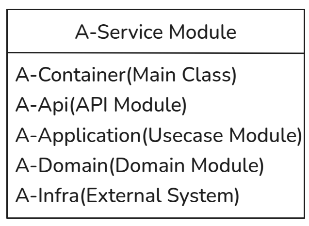

# 암호화폐 거래소 클론 프로젝트

### **프로젝트 관리자**

### **프로젝트 Github 주소**

[GitHub - ziogenorwekh/cryptocurrency-project](https://github.com/ziogenorwekh/cryptocurrency-project/tree/dev)

### **프로젝트 기간**

2025.06.06 ~

# 🎯프로젝트 목표

---

<aside>
 암호화폐 거래를 제공하는 회사의 API를 활용하여 암호화폐 거래 및 AI 분석을 포함한 암호화폐 거래소 웹페이지 클론 프로젝트

</aside>

# 🏁프로젝트 결과

---

# 📎기술 스택

---

### **📌 백엔드 기술 스택**

- **프레임워크**: Spring Framework
- **언어**: Java
- **빌드 도구**: Gradle
- **데이터베이스**: MySQL(테스트 및 배포), H2Database(테스트)
- **아키텍처**: MSA(Microservices Architecture)
- **ORM(Object-Relational Mapping)**: JPA
- **서비스 간 통신**: **Apache Kafka** (비동기 메시징 브로커)
- **실시간 통신**: **WebSocket**
- **캐시 저장: Redis**

### **📌 인프라 & 배포**

- **컨테이너화**: Docker
- **컨테이너 오케스트레이션**: Kubernetes
- **구성 관리 & 자동화**: Jenkins (로컬 실행) / Ansible (원격 실행)
- **클라우드 서비스(AWS)**
    - EC2 (컴퓨팅), Route 53 (DNS 관리), RDS (데이터베이스 관리)

**모니터링 & 시각화**:

- **Prometheus**: 애플리케이션 및 시스템 메트릭 수집
- **Grafana**: Prometheus 데이터 시각화 대시보드

### **📌 프론트엔드 기술 스택**

- **프레임워크/라이브러리**: React
- **스타일링**: Bootstrap
- **HTTP 클라이언트**: Axios
- **인증**: Google Login, Naver Login
- **웹 서버/리버스 프록시**: Nginx
- **실시간 통신**: **WebSocket API 또는 라이브러리**

### 📌 **개발 방식**

- **Agile 방법론**
- **테스트 주도 개발(TDD) , 도메인 주도 개발(DDD)**
- **헥사고날 아키텍처(Ports & Adapters), 유스케이스 중심 설계**
- **단위 테스트**: JUnit, Mockito
- **통합 테스트**: Spring Test
- **성능/부하 테스트**: Apache JMeter (K8s 환경 부하 테스트 및 모니터링 연동 목적)

# 🧍요구사항

---

## 기능 명세서

<aside>
 [1] **사용자 접속 및 로그인**
└─> 프론트엔드에서 Google OAuth 등으로 인증 요청
└─> 유저 서비스에서 인증 처리 및 JWT 발급

[2] **마켓 데이터 조회**
└─> 프론트엔드에서 시세/호가/체결 데이터 요청
└─> 거래 서비스 → 외부 거래소 API 연동 or 캐시/DB에서 조회
└─> 프론트에 최신 시세 정보 반환

[3] **AI 기반 시장 분석 결과 제공**
└─> 사용자가 거래 페이지 접근 시, 6시간마다 갱신된 AI 분석 결과 표시
└─> Market Data Collection & Analysis Service에서

- 외부 시세 수집

- OpenAI 호출

- 분석 결과 캐시 후 제공

[4] **자산 현황 및 거래 내역 확인**
└─> 프론트엔드에서 포트폴리오 조회 요청
└─> 포트폴리오 서비스에서 유저 잔고, 평가 손익 계산
└─> 유저 서비스에서 거래 내역 조합해 종합 응답

[5] **주문 기능 (매수/매도/예약주문)**
└─> 프론트에서 거래 요청 (주문하기/취소 등)
└─> 거래 서비스에서 주문 유효성 검사 및 처리
└─> 거래소 API 또는 시뮬레이션 엔진 연동
└─> 결과 기록 후 유저/포트폴리오 서비스에 반영

</aside>

## API 명세서

### 1. 유저 서비스 (User Service API)

| 기능 | HTTP Method | URI | 설명 | 요청 바디 예시 (요약) |
| --- | --- | --- | --- | --- |
| 이메일 인증 요청 | POST | /emails | 사용자 이메일로 인증 코드 발송 | `{ "email": "user@example.com" }` |
| 이메일 인증 요청 | POST | /emails/confirm | 사용자 이메일 인증 코드 확인 | `{ "email": "user@example.com" , "code": "123456" }` |
| 사용자 생성(회원가입) | POST | /users | 신규 사용자 등록 | `{ "email": "...", "password": "...", "username": "..." }` |
| 비밀번호 초기화 | PUT | /users/{userId}/reset/password | 사용자 비밀번호 초기화 | `{ "email": "user@example.com" }` |
| 사용자 프로필 조회 | GET | /users/{userId} | 특정 사용자 프로필 조회 | `{"email":"...","username":"..."}` |
| 사용자 프로필 수정 | PUT | /users/profile/{userId} | 사용자 프로필 이미지 수정 | `{ "profileImg": "..." }` |
| 거래내역 조회 | GET | /users/{userId}/transactions | 사용자 거래 내역 조회 | - |
| 2단계 인증 설정 조회 | PUT | /users/{userId}/security | 2단계 인증 설정 조회 | `{ "enable2FA": value, "secret": "..." }` |
| 2단계 인증 설정 시작 | PUT | /users/{userId}/security/setting | 2단계 인증 설정 시작 | `{ "enable2FA": true, "secret": "..." }` |
| 2단계 인증 설정 | PUT | /users/{userId}/security/confirm | 2단계 인증 설정 확인 | `{ "enable2FA": true, "secret": "..." }` |
| 사용자 삭제 | DELETE | /users/{userId} | 사용자 계정 삭제 | - |
| 로그인 | POST | /login | 로그인 요청 및 JWT 토큰 발급 | `{ "email": "...", "password": "..." }` |
| 로그인 | POST | /login/2fa | 로그인 요청 및 JWT 토큰 발급 | `{ "email": "...", "password": "..." }` |

### 2. 거래 서비스 (Trading Service API)

| 기능 | HTTP Method | URI | 설명 | 요청 바디 예시 (요약) |
| --- | --- | --- | --- | --- |
| 시세 종목 조회 | GET | /market/items | 거래 가능한 종목 목록 조회 | - |
| 시세 캔들 데이터 조회 | GET | /market/items/{itemId}/candles | 특정 종목의 캔들 차트 데이터 조회 | 쿼리파라미터로 기간 지정 가능 |
| 시세 체결 내역 조회 | GET | /market/items/{itemId}/trades | 특정 종목의 최근 체결 내역 조회 | 쿼리파라미터로 limit, since 지정 가능 |
| 현재가 조회 | GET | /market/items/{itemId}/ticker | 특정 종목의 현재가 조회 | - |
| 호가 정보 조회 | GET | /market/items/{itemId}/orderbook | 특정 종목의 호가(매수/매도 주문서) 정보 조회 | - |
| 주문 목록 조회 | GET | /orders | 사용자 전체 주문 목록 조회 (필터 가능) | 쿼리파라미터(userId, status 등) |
| 특정 주문 조회 | GET | /orders/{orderId} | 주문 상세 정보 조회 | - |
| 주문 생성 (매수/매도) | POST | /orders | 신규 주문 생성 | `{ "userId": 1, "itemId": "BTC", "type": "buy", "price": 10000, "quantity": 0.1 }` |
| 주문 취소 | DELETE | /orders/{orderId} | 기존 주문 취소 | - |
| 예약 매수 주문 생성 | POST | /orders/reservations/buying | 예약 매수 주문 생성 | `{ "userId": 1, "itemId": "BTC", "price": 9500, "quantity": 0.1, "executeAt": "2025-06-10T10:00:00Z" }` |
| 예약 매도 주문 생성 | POST | /orders/reservations/selling | 예약 매도 주문 생성 | `{ "userId": 1, "itemId": "BTC", "price": 10500, "quantity": 0.1, "executeAt": "2025-06-10T10:00:00Z" }` |
| 예약 주문 목록 조회 | GET | /orders/reservations | 예약 주문 목록 조회 | 쿼리파라미터(userId 등) |
| 예약 주문 취소 | DELETE | /orders/reservations/{reservationId} | 예약 주문 취소 | - |
| 수수료 쿠폰 적용 | PUT | /orders/{orderId}/coupon | 특정 주문에 수수료 쿠폰 적용 | `{ "couponId": "abc123" }` |

### 3. 포트폴리오 서비스 (Portfolio Service API)

| 기능 | HTTP Method | URI | 설명 | 요청 바디 예시 (요약) |
| --- | --- | --- | --- | --- |
| 잔고 조회 | GET | /portfolio/{userId}/balance | 특정 사용자 자산 잔고 조회 | - |
| 자산 현황 조회 | GET | /portfolio/{userId}/assets | 특정 사용자 자산 현황(평가 금액 등) 조회 | - |
| 평가 손익 조회 | GET | /portfolio/{userId}/profitloss | 사용자 평가 손익 조회 | - |
| 입출금 내역 조회 | GET | /portfolio/{userId}/transactions | 입출금 내역 및 자산 변동 기록 조회 | - |
| 자산 변동 기록 생성 | POST | /portfolio/{userId}/transactions | 자산 변동 내역 생성 (입금, 출금 등) | `{ "type": "deposit", "amount": 1000, "timestamp": "..." }` |

### 4. 시장 데이터 수집 및 분석 서비스 (Market Data Collection & Analysis Service API)

| 기능 | HTTP Method | URI | 설명 | 요청 바디 예시 (요약) |
| --- | --- | --- | --- | --- |
| 외부 시세 데이터 수집/갱신 | POST | /marketdata/refresh | 외부 거래소 API로부터 시세 데이터 수집 및 갱신 | - |
| 시세 데이터 조회 | GET | /marketdata/items/{itemId} | 특정 종목의 시세 데이터 조회 | - |
| AI 분석 결과 조회 | GET | /marketdata/analysis | 최신 AI 기반 시장 분석 결과 조회 | - |
| AI 분석 결과 갱신 | POST | /marketdata/analysis/refresh | AI 분석 결과 6시간마다 갱신 (수동 호출 가능) | - |
| 캐시된 분석 결과 조회 | GET | /marketdata/analysis/cache | 캐시된 AI 분석 결과 조회 | - |

### 5. 쿠폰 서비스 (Coupon Service API)

| 기능 | HTTP Method | URI | 설명 | 요청 바디 예시 (요약) |
| --- | --- | --- | --- | --- |
| 쿠폰 발급 | POST | /coupons | 사용자 수수료 할인 쿠폰 발급 | `{ "userId": 1, "discount": 10, "validUntil": "2025-12-31" }` |
| 쿠폰 조회 | GET | /users/{userId}/coupons | 사용자 수수료 할인 쿠폰 목록 조회 | - |
| 쿠폰 삭제 | DELETE | /coupons/{couponId} | 특정 쿠폰 삭제 | - |

# 🛠️설계

---

## **📒헥사고날 아키텍처**

## 📒멀티 모듈

## 서비스별 동작 기능

### 1. 유저 서비스 (User Service)

- 회원가입, 로그인, 인증/인가 (JWT, OAuth 등)
- 프로필 관리
- 기본 거래내역 저장 및 조회 (간단히 기록)
- 비밀번호 재설정, 2단계 인증(선택사항)

### 2. 거래 서비스 (Trading Service)

- 시세 종목 조회 (MarketItem)
- 시세 캔들, 체결, 현재가(Ticker), 호가(OrderBook) 조회
- 주문 처리: 주문 생성, 주문 취소
- 예약매수, 예약매도 등 주문 예약 기능
- 주문 상태 관리 및 거래 체결 처리

### 3. 포트폴리오 서비스 (Portfolio Service)

- 유저별 자산 현황, 잔고 계산
- 평가손익 관리 (실시간 혹은 주기적)
- 입출금 내역 통합 관리 (간단 버전)
- 자산 변동 히스토리 기록 및 조회

### 4. 시장 데이터 수집 및 분석 서비스 (Market Data Collection & Analysis Service)

- 외부 거래소 API로부터 시세 및 거래 데이터 수집
- 데이터 정제, 캐싱 및 저장
- 시세 데이터 API 제공 (거래 서비스와 분리하여 부하 분산)
- 데이터 갱신 주기 관리
- AI를 활용하여 추세 또는 예측

**쿠폰 서비스 (Coupon Service)**

- 수수료 할인 쿠폰 관리 (발급, 조회, 삭제)
- 쿠폰 적용 및 유효성 검사

## 서비스별 도메인 엔티티

- **유저 서비스 (User Service)**
    - **User**: 사용자 계정 정보 (ID, 이메일, 비밀번호, 프로필, 권한 등)
    - **Role**: 사용자 권한 정보 (관리자, 유저)
    - **SecuritySettings**: 2단계 인증 설정 정보 (활성화 여부, 인증 방법 등)
    - **TransactionHistory**: 유저의 기본 거래 내역 기록 (간단한 주문 기록)

- **시장 데이터 수집 및 분석 서비스 (Market Data Collection & Analysis Service)**
    - **MarketData**: 외부 API에서 수집한 시세 데이터 (종목별 시세, 체결, 호가 등)
    - **CandleStick**: 시세 캔들 정보 (시간대별 시가, 종가, 고가, 저가, 거래량)
    - **AIAnalysisResult**: AI 기반 시장 분석 결과 (예측, 트렌드, 신호 등)
    - **DataRefreshSchedule**: 데이터 갱신 주기 및 상태 정보

- **거래 서비스 (Trading Service)**
    - **MarketItem**: 거래 가능한 암호화폐 종목 정보 (심볼, 이름, 기본 단위 등)
    - **Order**: 주문 정보 (주문 ID, 유저 ID, 종목, 주문 타입(buy/sell), 수량, 가격, 상태)
    - **OrderBook**: 호가 정보 (매수/매도 리스트, 가격과 수량)
    - **TradeExecution**: 체결된 거래 내역 (체결 ID, 주문 ID, 체결 가격, 수량, 시간)
    - **ReservationOrder**: 예약 주문 정보 (예약 시간, 주문 상세)

- **포트폴리오 서비스 (Portfolio Service)**
    - **Portfolio**: 유저별 자산 현황 (각 암호화폐별 보유 수량, 총 평가 금액)
    - **Balance**: 유저의 잔고 (총 자산, 현금 잔고 등)
    - **ProfitLoss**: 평가 손익 내역 (실현/미실현 손익)
    - **DepositWithdrawal**: 입출금 기록 (금액, 일시, 유형)
    - **AssetChangeLog**: 자산 변동 기록 (변동 원인, 일시, 변동 금액)
- **쿠폰 서비스 (Coupon Service)**
    - **Coupon**: 수수료 할인 쿠폰 정보 (쿠폰 코드, 할인율, 만료일, 사용자 ID 등)

## 서비스별 도메인 엔티티 관계

- **유저 서비스 (User Service)**
    - **User 1 : 1 SecuritySettings**
        - 유저 당 2단계 인증 설정 정보 1개
    - **User 1 : N TransactionHistory**
        - 유저는 여러 거래 기록을 가질 수 있음
    - **User 1 : N Role**
        - 유저는 여러 권한을 가질 수 있음
- **쿠폰 서비스 (Coupon Service)**
    - **User 1 : N Coupon**
        - 유저별로 여러 개의 쿠폰 발급 가능

- **시장 데이터 수집 및 분석 서비스 (Market Data Collection & Analysis Service)**
    - **MarketItem 1 : N MarketData**
        - 하나의 종목에 여러 시세 데이터 존재
    - **MarketItem 1 : N CandleStick**
        - 하나 종목에 여러 시간대별 캔들스틱 데이터
    - **MarketData 1 : 1 AIAnalysisResult**
        - 시세 데이터 하나에 대응하는 AI 분석 결과 존재 (또는 주기별 분석 결과와 매칭)
    - **DataRefreshSchedule 1 : N MarketData**
        - 데이터 갱신 일정에 따라 여러 시세 데이터 갱신

- **거래 서비스 (Trading Service)**
    - **User 1 : N Order**
        - 한 유저는 여러 주문(매수/매도)을 낼 수 있음
    - **Order 1 : N TradeExecution**
        - 한 주문이 여러 번 부분 체결될 수 있음
    - **OrderBook 1 : N Order**
        - 호가별로 여러 주문이 쌓임 (매수 호가, 매도 호가 각각 리스트)
    - **ReservationOrder 1 : 1 Order**
        - 예약 주문은 실제 주문과 1:1 대응

- **포트폴리오 서비스 (Portfolio Service)**
    - **User 1 : 1 Portfolio**
        - 유저마다 하나의 포트폴리오 보유
    - **Portfolio 1 : N Balance**
        - 포트폴리오 내 여러 암호화폐 잔고
    - **Portfolio 1 : N ProfitLoss**
        - 포트폴리오 평가 손익 기록 여러 개
    - **User 1 : N DepositWithdrawal**
        - 유저가 여러 입출금 기록 가짐
    - **Portfolio 1 : N AssetChangeLog**
        - 포트폴리오 내 자산 변동 로그 여러 개

## 서비스 플로우

## 1. 유저 서비스

### 1. 유저 생성 (회원가입) 플로우

- **`POST /emails` (이메일 인증 코드 요청)**
    - **사용자 입력**: 가입하려는 **이메일 주소**를 입력하고 인증 요청.
    - **서비스 로직**:
        - 이메일 형식 유효성 검사 (`Email.isValidEmailStyle`).
        - 해당 이메일이 **이미 가입되어 있는지 확인**. (이미 가입된 경우 적절한 에러 반환)
        - **고유한 인증 코드 생성** (예: 6자리 숫자).
        - 인증 코드를 **특정 시간 동안 유효하게 DB/캐시에 저장** (`email`과 `code`, `expirationTime` 매핑).
        - `EmailService`를 통해 사용자 **이메일로 인증 코드 발송**.
        - 성공 응답 반환.
- **`POST /emails/confirm`(이메일 인증 코드 확인)**
    - **사용자 입력**: 이전 단계에서 받은 **이메일 주소**와 **인증 코드** 입력.
    - **서비스 로직**:
        - DB/캐시에서 해당 이메일과 매핑된 저장된 인증 코드를 조회.
        - 입력된 코드와 저장된 코드가 **일치하는지 확인**.
        - **코드의 유효 시간 만료 여부 확인**. (만료 시 에러 처리)
        - **인증 성공 시**: 해당 이메일이 **인증되었음을 나타내는 임시 토큰 (예: JWT)**을 생성하여 프론트엔드에 반환. 이 토큰은 **짧은 유효 기간**을 가지고, 이메일이 인증되었으며 이제 회원가입을 진행할 수 있다는 정보만 담아야 합니다. (예: `{"email": "...", "verified": true}`).
        - **인증 실패 시**: "인증 코드가 일치하지 않거나 만료되었습니다"와 같은 에러 반환.
- **`POST /users` (실제 사용자 생성/회원가입)**:
    - **사용자 입력**: 회원가입 폼에 입력된 **이메일, 비밀번호, 사용자 이름** 등. **`POST /emails/confirm`에서 받은 임시 토큰**을 요청 헤더(예: `Authorization: Bearer <temp_token>`)에 포함.
    - **서비스 로직**:
        - 요청 헤더의 임시 토큰을 파싱하여 **이메일 인증이 완료되었는지 확인** (`verified: true` 여부). 토큰이 없거나 유효하지 않으면 회원가입 불가.
        - **비밀번호 패턴 유효성 검사**.
        - **사용자 이름 패턴 유효성 검사**.
        - 새로운 `User` 엔티티를 생성 (`User.createUser` 메서드 사용). 이 과정에서 비밀번호는 **해싱**됩니다.
        - `User` 엔티티를 데이터베이스에 **저장**.
        - 회원가입 성공 시, **즉시 로그인 처리를 원한다면 JWT 발급** 후 반환. (또는 단순히 성공 메시지 반환).

### **2. 유저 비밀번호 초기화**

- **`POST** /users/{userId}/reset/password` **(비밀번호 초기화 요청)**
    - **사용자 입력**: 비밀번호를 초기화하려는 계정의 **이메일 주소**.
    - **서비스 로직**:
        - 입력된 이메일로 **`User`를 조회**. (사용자 존재 여부 확인)
        - **고유한 `PasswordResetToken` (UUID 형태)** 생성.
        - 생성된 토큰에 **만료 시간 (예: 10~30분)** 설정.
        - 토큰을 **데이터베이스에 저장**하고 해당 `User`와 연결.
        - `EmailService`를 통해 사용자 이메일로 **초기화 링크가 포함된 이메일 발송**. (링크에는 생성된 토큰이 포함됨)
        - 보안을 위해 **항상 성공 응답을 반환** (실제 사용자가 존재하든 안 하든). 이는 특정 이메일이 시스템에 등록되어 있는지 노출하는 것을 방지합니다.
- **`GET` /reset-password?token=xxxxxx** **(초기화 링크 진입, 재설정 처리)**
    - **사용자 입력**: 없음 (URL에 포함된 **토큰** 사용)
    - **서비스 로직**:
        - 전달받은 **토큰으로 `PasswordResetToken` 조회**
        - 다음 조건을 검증:
            - **토큰 존재 여부**
            - **만료 여부**
            - **이미 사용되었는지 여부**
        - 유효한 경우:
            - 비밀번호 재설정 입력 폼을 프론트엔드에 전달 (또는 해당 페이지로 리다이렉트)
        - 유효하지 않은 경우:
            - 에러 메시지 또는 "토큰이 유효하지 않음" 안내 페이지 반환

    ---

- **`POST` /users/reset-password** **(새로운 비밀번호 제출)**
    - **사용자 입력**:
        - **token** (숨겨진 필드 또는 쿼리 파라미터)
        - **newPassword**
        - **confirmPassword**
    - **서비스 로직**:
        - **토큰으로 `PasswordResetToken` 조회**
        - 다음 조건을 검증:
            - **토큰 존재 여부**
            - **만료 여부**
            - **이미 사용되었는지 여부**
        - 비밀번호 유효성 검증:
            - 비밀번호와 확인값이 일치하는지
            - 보안 규칙에 따른 유효한 포맷인지 (길이, 문자 조합 등)
        - 유효한 경우:
            - 해당 `User`의 **비밀번호를 해싱 후 업데이트**
            - 토큰을 **소모 처리** (삭제 또는 사용됨으로 마킹)
        - 성공 응답 반환 (또는 로그인 페이지로 리다이렉트)

### **3. 거래 히스토리 조회**

**`GET /users/{userId}/transactions` (거래 히스토리 조회)**

- **요청**: 로그인한 사용자 ID (`userId`) 포함. (인증 토큰으로 `userId` 검증)
- **서비스 로직**:
    - 요청한 `userId`가 **인증된 사용자의 ID와 일치하는지 (또는 관리자 권한인지) 확인**합니다.
    - **`Trading Service` 호출**: 해당 `userId`의 **거래(주문 및 체결) 내역을 조회**합니다. (예: `TradingService.getOrdersByUserId(userId)` 또는 `TradingService.getTradeExecutionsByUserId(userId)`)
    - **`Trading Service` 또는 `Market Data Service` 호출**: 조회된 거래 내역에 포함된 종목(itemId)들의 상세 정보 (영문명, 한글명)**를 가져옵니다. (예: `TradingService.getMarketItemDetails(itemId)` 또는 `MarketDataService.getMarketDataItem(itemId)`)
    - **데이터 매핑 및 조합**: `Trading Service`에서 가져온 거래 내역 데이터와 종목 상세 데이터를 **매핑**하여 필요한 정보를 하나의 구조화된 `List` 형태로 가공합니다.
    - **응답 반환**: 가공된 **거래 히스토리 `List`**를 프론트엔드에 반환합니다.

### **4. 2단계 인증 설정**

- **`GET /users/{userId}/security` (현재 2단계 인증 설정 조회)**
    - **요청**: 로그인한 사용자 ID (`userId`) 포함.
    - **서비스 로직**: `User` 엔티티의 `SecuritySettings`를 조회하여 현재 2FA 활성화 여부, 설정된 방식 등을 반환. (클라이언트가 현재 상태를 파악)
- **`PUT /users/{userId}/security/setting` (2단계 인증 설정 시작/변경 요청)**:
    - **사용자 입력**: `enable2FA` (활성화/비활성화 여부), `method` (OTP_APP, SMS, EMAIL 중 선택).
    - **서비스 로직**:
        - `enable2FA`가 `false`이면 2FA를 즉시 비활성화하고 저장.
        - `enable2FA`가 `true`이면, `method`에 따라 다음을 수행:
            - **`OTP_APP`**: 새로운 **`secret` 키를 생성**하고, 이를 `User`의 `SecuritySettings`에 '임시 저장'하거나 '대기' 상태로 표시. 프론트엔드에 **QR 코드 생성에 필요한 정보(secret, issuer 등)**를 반환. (이 단계에서는 아직 2FA가 완전히 활성화된 것이 아님).
            - **`SMS` 또는 `EMAIL`**: 사용자 연락처(DB에서 조회)로 **인증 코드 발송**. 발송된 코드를 DB/캐시에 임시 저장 (`userId`, `method`, `code`, `expirationTime` 매핑). 프론트엔드에게 코드 입력을 요청하는 응답 반환. (역시 아직 2FA 활성화 아님).
- **`POST /users/{userId}/security/confirm` (2단계 인증 설정 최종 확인)**
    - **사용자 입력**: 이전 단계에서 생성된 **인증 코드** (SMS/Email의 경우) 또는 **OTP 앱에서 생성된 코드** (OTP 앱의 경우).
    - **서비스 로직**:
        - `method`에 따라 코드 검증 로직 수행:
            - **`SMS/EMAIL`**: DB/캐시에 저장된 코드가 입력 코드와 일치하고 만료되지 않았는지 확인.
            - **`OTP_APP`**: 이전에 임시 저장했던 `secret` 키와 입력된 코드를 사용하여 OTP 라이브러리로 **코드가 유효한지 검증**.
        - **검증 성공 시**: `User`의 `SecuritySettings`를 **완전히 '활성화' 상태로 업데이트**하고, `method` 및 `secret` (OTP의 경우)을 최종 저장.
        - **검증 실패 시**: 오류 반환.
- **로그인 시 2단계 인증 처리 플로우**:
    - **`POST /login` (초기 로그인 요청)**:
        - **서비스 로직**: 사용자 ID/비밀번호 검증 후, `User`의 `SecuritySettings`를 조회.
        - **만약 2FA가 활성화되어 있다면**:
            - 클라이언트에게 '2단계 인증이 필요함'을 알리는 응답을 반환. (예: `{"status": "2FA_REQUIRED", "method": "SMS"}`)
            - 해당 `method`에 따라 (SMS/EMAIL) **새로운 인증 코드를 발송** (이메일 서비스 등 호출).
            - (OTP 앱의 경우 코드를 발송하지 않고, 클라이언트가 OTP 앱에서 코드를 받아 입력하도록 유도).
        - **2FA가 활성화되어 있지 않다면**: 즉시 JWT 발급 후 성공 응답 반환.
    - **`POST /login/2fa`(2단계 인증 코드 확인)**:
        - **사용자 입력**: 2단계 인증 코드.
        - **서비스 로직**:
            - 세션 또는 임시 토큰으로 **현재 로그인 시도 중인 사용자를 식별**.
            - 해당 사용자의 `SecuritySettings`를 조회.
            - 입력된 코드가 **설정된 2FA 방식에 따라 유효한지 검증** (SMS/Email 코드 일치 여부, OTP 코드 유효성).
            - **검증 성공 시**: 최종적으로 JWT 발급 후 성공 응답 반환.
            - **검증 실패 시**: 오류 반환.

### **5. 프로필 이미지 수정**

- **5.1 프로필 이미지 수정 (`PUT /users/{userId}/profile`)**
    - **사용자 입력**: 변경할 프로필 이미지의 **새 `profileImage`** (클라이언트가 먼저 버킷에 업로드 후 얻은 키).
    - **서비스 로직**:
        - 요청한 `userId`가 **인증된 사용자의 ID와 일치하는지** (또는 관리자 권한인지) 확인.
        - 제공된 `profileImage`의 **유효성 검사** (예: 해당 키가 실제로 유효한 버킷 객체인지, 특정 사용자만 접근 가능한 키인지 등 - 필요시).
        - `User` 엔티티를 조회하고, **`User` 엔티티의 `updateProfileImage(newProfileImageKey)`와 같은 메서드를 호출**하여 프로필 이미지 키를 업데이트.
        - 업데이트된 `User` 엔티티를 데이터베이스에 저장.
        - 성공 응답 반환.
        - (선택 사항): 기존 프로필 이미지가 있다면, 버킷에서 **이전 이미지 파일을 삭제하는 로직**을 추가하여 스토리지 낭비를 방지.

### **쿠폰 조회(쿠폰 서비스) — 임시 저장**

- **6.1 보유 쿠폰 목록 조회 (`GET /users/{userId}/coupons`)**
    - **사용자 입력**: 없음 (요청 시 사용자 ID는 Path Variable로 전달됨)
    - **서비스 로직**:
        - 요청한 `userId`가 **인증된 사용자의 ID와 일치하는지** (또는 관리자 권한인지) 확인.
        - 해당 사용자의 **보유 쿠폰 목록을 데이터베이스에서 조회**.
            - 쿠폰 상태(예: 사용 가능, 만료됨, 이미 사용됨 등) 기준으로 필터링 가능.
        - 각 쿠폰에 대해 다음 정보를 포함하는 응답 생성:
            - 쿠폰 ID
            - 쿠폰명
            - 할인 방식 (정액 / 정률)
            - 할인 금액 또는 비율
            - 사용 조건 (예: 최소 주문 금액)
            - 만료일
            - 사용 가능 여부 등
        - **쿠폰 정보 리스트를 반환**.

# 💡구현

---

# 🚀배포 및 운영

---

# 🚧 트러블슈팅

---